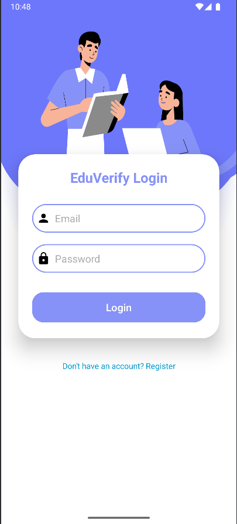
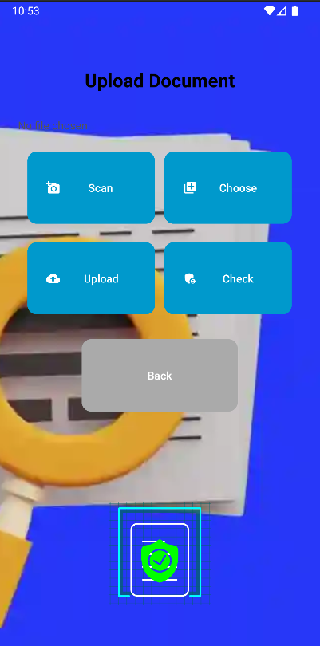

# 📚 Smart Class Reminder App

An Android application built using **Kotlin** that helps students manage their class schedules by sending reminders 1 hour prior to class. The app also includes **document verification**, **student authentication**, and **academic record management**, making it a complete academic assistant for students.

## ✨ Features

- 🔔 **Class Reminders**  
  Sends automatic notifications to students one hour before their scheduled classes.

- 🔐 **Firebase Authentication**  
  Secure login and user authentication using Firebase.

- 📄 **Document Upload & Verification**  
  Upload academic documents (ID cards, mark sheets, etc.) and verify them using integrated text extraction.

- 🧠 **Text Extraction with OCR**  
  Extracts text from uploaded images using OCR libraries to validate student information.

- ☁️ **Cloud Storage with Cloudinary**  
  Stores and retrieves document images using Cloudinary for secure, scalable media storage.

- 🗂️ **Academic Records Management**  
  Stores, displays, and updates student academic data in an organized format.

## 🛠️ Tech Stack

- **Kotlin** – Core development language  
- **Android Studio** – Development environment  
- **Firebase Authentication** – User login and authentication  
- **Cloudinary** – Image storage and management  
- **Text Extraction Library (OCR)** – For document verification  
- **Jetpack Components** – Modern Android architecture components

## 📷 Screenshots

### 🔐 Login Screen


### 📄 Document Upload


## 🚀 Getting Started

1. Clone this repository:
   ```bash
   git clone https://github.com/yourusername/class-reminder-app.git
